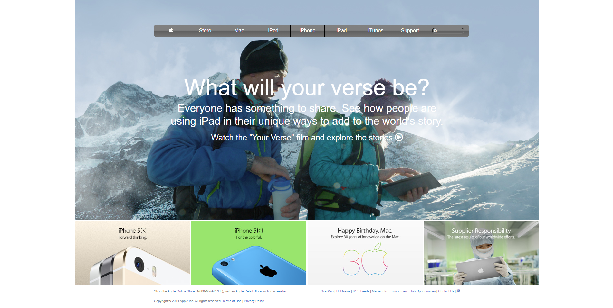

# Background & Color Gradient

A clone of the Old School Apple Page using Flexbox for positions and using background positions attributes to properly clone the background image as well as using color gradients for the navbar

## Built With

- HTML
- CSS

## Live Demo

[Live Demo Link](https://rawcdn.githack.com/Janluc/apple-clone/2dfa14cbdbf929fa420ee78dafa00d7904d059bb/index.html)

## Getting Started

To get a local copy up and running follow these simple example steps.

### Prerequisites

- A operating system such as Windows, MAC, or Linux
- A modern browser such as Google Chrome, Mozilla Firefox, or Microsoft Edge

### Setup
- Clone or download the repo and run the index.html File.

### Run tests
- [We use Stylelint, Lighthout, & Webhint](https://github.com/Janluc/apple-clone/pull/1/checks)
- Linters #5: Pull request #1 synchronize by Janluc

## Authors

👤 **Author1**

- GitHub: [@alejandrotoledoweb](https://github.com/alejandrotoledoweb)
- Twitter: [@alejot](https://twitter.com/alejot)
- LinkedIn: [LinkedIn](https://www.linkedin.com/in/alejandro-toledo-3b444b109/)

👤 **Author2**

- GitHub: [@Janluc](https://github.com/Janluc)
- Twitter: [@Janluc123](https://twitter.com/Janluc123)
- LinkedIn: [LinkedIn](https://www.linkedin.com/in/janluc-saneaux-91707a1b4/)

## 🤝 Contributing

Contributions, issues, and feature requests are welcome!

## Show your support

Give a ⭐️ if you like this project!!
